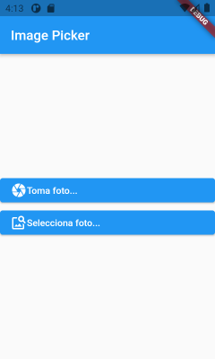
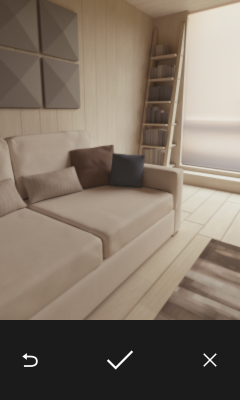
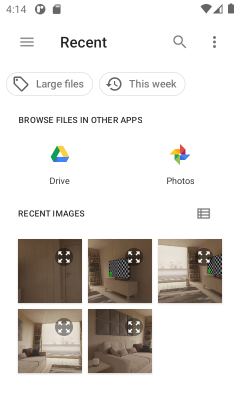
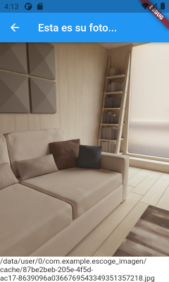

# EscogeImagen

App Flutter para escoger una imagen de dos posibles fuentes: tomarla con la cámara del sistema o seleccionarla  de la galería

## Preparación

Descargue el proyecto y ábralo en su IDE de preferencia. Android Studio y Visual Studio Code son muy apropiadas.

> Si tiene problemas con ello, tal vez deba revisar primero: https://github.com/dordonez-ute-moviles/Flutter-Tutorial

> Obtendrá una mejor comprensión del tema si revisa también https://github.com/dordonez-ute-moviles/TomaFoto, donde se usa la cámara a un nivel más bajo de abstracción.

## Requisitos previos

- En el archivo *./pubspec.yaml* se incluye la dependencia para el plugin que usaremos, en la sección `dependencies`, donde se añade `image_picker`.

> Obtendrá más e interesante información sobre el plugin en https://pub.dev/packages/image_picker.

- En emuladores Android 30 no se abren las cámaras, por lo que se aumentó el elemento `<queries>` en el AndroidManifest: *./android/app/src/main/AndroidManifest.xml*.

## Programa

Todo el código fuente se encuentra en el archivo *./lib/main.dart*, que vamos a analizar a continuación.

- Al inicio del archivo se importan las librerías necesarias:

```dart
import 'dart:io';
import 'package:image_picker/image_picker.dart';

import 'package:flutter/material.dart';
```

> *io* brinda los objetos para trabajar con archivos; *image_picker* proporciona los objetos para manipular el plugin.

- En main simplemente cargamos la página inicial `HomePage`:

```dart
void main() {
  runApp(
    MaterialApp(
      home: HomePage(),
    ),
  );
}
```

- A continuación necesitamos la página "home", que será la clase `HomePage`. Esta página presentará solamente dos botones. El primero permitirá tomar una foto con la cámara y el segundo presentará la galería para escoger una foto:

```dart
class HomePage extends StatelessWidget {

  @override
  Widget build(BuildContext context) {
    return Scaffold(
        appBar: AppBar(
          title: Text("Image Picker"),
        ),
        body: Center(child:
          Column(mainAxisAlignment: MainAxisAlignment.center,
            children: [
              ElevatedButton(
                  child: Row(children: [
                    Icon(Icons.camera),
                    Text('Toma foto...'),
                  ],),
                  onPressed: () {
                    getImageFromSource(context, ImageSource.camera);
                  }
              ),
              ElevatedButton(
                  child: Row(children: [
                    Icon(Icons.image_search),
                    Text('Selecciona foto...'),
                  ],),
                  onPressed: () {
                    getImageFromSource(context, ImageSource.gallery);
                  }
              ),
            ]
          ),
        ),
    );
  }
```

> Ambos botones invocan a la misma función: `getImageFromSource`. La diferencia radica en la "fuente". Para tomar la foto se utiliza `ImageSource.camera`, mientras que para llamar a la galería usamos `ImageSource.gallery`

- Es en la función `getImageFromSource` donde se utiliza realmente el plugin *image_picker*, el cual, dependiendo de la fuente, nos presentará o la cámara o la galería:

```dart
  void getImageFromSource(context, imageSource) async {
    XFile? pickedFile = await ImagePicker().pickImage(
      source: imageSource,
    );
    if (pickedFile != null) {
      Navigator.push(
        context,
        MaterialPageRoute(builder: (context) => ShowPicture(pickedFile.path)),
      );
    }
  }
```

> La primera acción que se realiza es llamar al plugin con `ImagePicker().pickImage(imageSource)`. Se usa *await* para esperar que el usuario seleccione o tome la imagen (el uso de *await* obliga a que `getImageFromSource` sea *async*). La imagen será devuelta en un `XFile?`; nótese el signo de interrogación, el cual indica que se puede recibir un valor nulo (si el usuario no selecciona nada o cancela la operación). Finalmente, si tenemos una selección, llamamos a `ShowPicture` con el path de la imagen.

- `ShowPicture` presentará tanto la imagen tomada, como, al pie de la página, el path donde se guardó el archivo con la imagen. Este archivo es solamente temporal, de manera que será eliminado al terminar la aplicación (se puede guardar permanentemente, claro):

```dart
class ShowPicture extends StatelessWidget {
  ShowPicture(this.imgpath);

  final String imgpath;

  @override
  Widget build(BuildContext context) {
    return Scaffold(
      appBar: AppBar(title: Text('Esta es su foto...')),
      body: Container(
        child: Image.file(File(imgpath), fit: BoxFit.cover),
        width: MediaQuery.of(context).size.width,
      ),
      bottomNavigationBar: BottomAppBar(child: Text('${imgpath}')),
    );
  }
}
```

> La imagen tomada se presenta dentro de un `Container`, al cual se le está instruyendo que ocupe todo el ancho de la pantalla, con el atributo `width:`. La imagen se carga con un `Image`, que la recupera del archivo, y la presenta ajustándola al container mediante el atributo `fit:`. Finalmente, al fondo de la pantalla se usa el `bottomNavigationBar:` para presentar un `BottomAppBar`, que en este caso tendrá solamente un `Text` con el path de la imagen.

Al ejecutarse la aplicación se debería ver algo parecido a las imágenes que se presentan a continuación:

   
